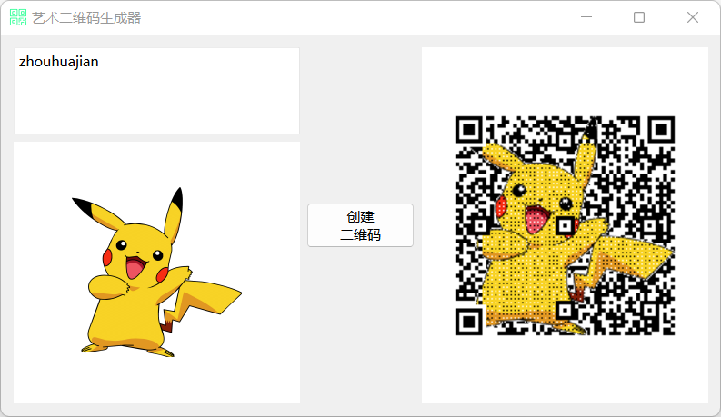
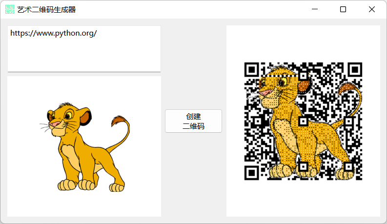

# Python PySide6 艺术二维码生成器项目

## 课程介绍

PySide6 是 Qt 官方提供的 Python 库，是一个功能齐全、功能强大的 GUI 库。

本课程将使用 PySide6 + Qt Designer + amzqr，带大家一步一步实现一个艺术二维码生成器项目。

课程主要内容有：

1. 使用 PySide6 开发程序主窗口；
2. 使用 Qt Designer 进行窗口界面设计；
4. 实现修改二维码背景图片；
5. 使用 amzqr 实现生成二维码；
6. 实现保存二维码。

## 项目截图

